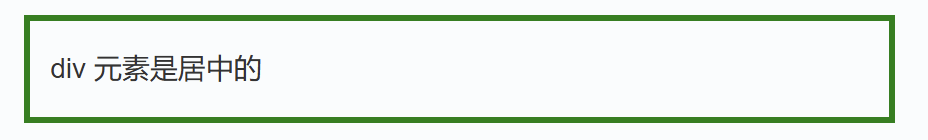
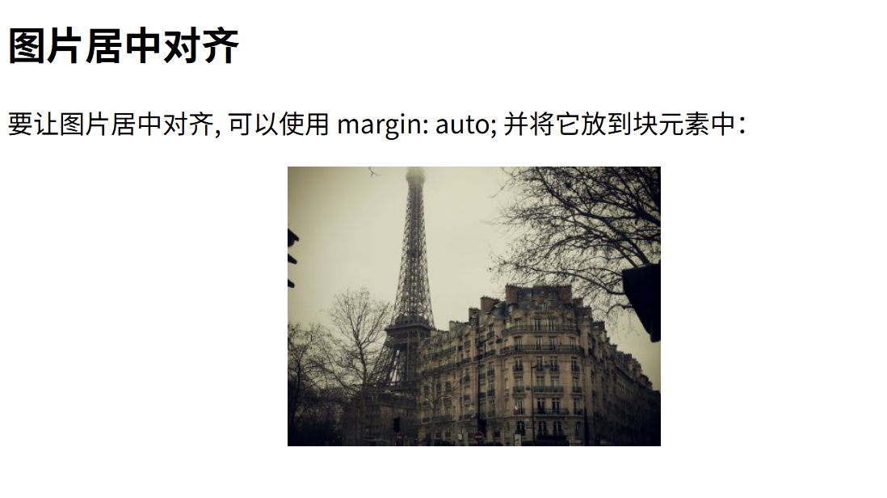

# CSS学习

- [CSS学习](#css学习)
  - [1 第一章：引入](#1-第一章引入)
    - [1.1 CSS发展历史](#11-css发展历史)
    - [1.2 什么是CSS](#12-什么是css)
    - [1.3 来个实例](#13-来个实例)
  - [第二章：语法](#第二章语法)
    - [2.1 选择器](#21-选择器)
      - [2.1.1 进一步的：ID选择器](#211-进一步的id选择器)
      - [2.1.2 进一步的：class选择器](#212-进一步的class选择器)
      - [2.1.3 进一步的：标签选择器](#213-进一步的标签选择器)
      - [2.1.4 进一步的：在标签内写css代码](#214-进一步的在标签内写css代码)
      - [优先级](#优先级)
      - [补充](#补充)
    - [2.2 如何创建CSS](#22-如何创建css)
      - [2.2.1 外部样式表](#221-外部样式表)
      - [2.2.2 内部样式表](#222-内部样式表)
      - [2.2.3 内联样式表](#223-内联样式表)
      - [2.2.4 多重样式](#224-多重样式)
      - [2.2.5 多重样式优先级](#225-多重样式优先级)
    - [2.3 背景属性](#23-背景属性)
      - [2.3.1 background-color](#231-background-color)
      - [2.3.2 background-image](#232-background-image)
      - [2.3.3 background-repeat](#233-background-repeat)
      - [2.3.4 background-position](#234-background-position)
      - [2.3.5 background-attachment](#235-background-attachment)
      - [简写属性](#简写属性)
    - [2.4 文本格式](#24-文本格式)
      - [2.4.1 文本颜色](#241-文本颜色)
      - [2.4.2 文本对齐方式](#242-文本对齐方式)
      - [2.4.3 文本修饰](#243-文本修饰)
      - [2.4.4 文本转换](#244-文本转换)
      - [2.4.5 文本缩进](#245-文本缩进)
    - [2.5 CSS字体](#25-css字体)
      - [2.5.1 字型](#251-字型)
      - [2.5.2 字体系列font-family](#252-字体系列font-family)
      - [2.5.3 字体样式font-style](#253-字体样式font-style)
      - [2.5.4 字体大小font-size](#254-字体大小font-size)
      - [2.5.5 用em来设置字体大小](#255-用em来设置字体大小)
      - [2.5.6 字体粗细font-weight](#256-字体粗细font-weight)
    - [2.6 CSS链接](#26-css链接)
      - [2.6.1 链接样式](#261-链接样式)
      - [2.6.2 链接的修饰](#262-链接的修饰)
    - [2.7 CSS列表](#27-css列表)
      - [2.7.1 两种类型](#271-两种类型)
      - [2.7.2 列表项标记list-style-type](#272-列表项标记list-style-type)
      - [2.7.3 简写属性](#273-简写属性)
      - [2.7.4 移除默认设置](#274-移除默认设置)
    - [2.8 CSS表格](#28-css表格)
      - [2.8.1 表格边框](#281-表格边框)
      - [2.8.2 折叠边框](#282-折叠边框)
      - [2.8.3 表格宽度和高度](#283-表格宽度和高度)
      - [2.8.4 表格文字对齐](#284-表格文字对齐)
      - [2.8.5 表格填充](#285-表格填充)
      - [2.8.6 表格颜色](#286-表格颜色)
    - [2.9 CSS盒子模型](#29-css盒子模型)
      - [2.9.1 CSS 盒子模型(Box Model)](#291-css-盒子模型box-model)
      - [2.9.2 元素的宽度和高度](#292-元素的宽度和高度)
    - [2.10 CSS边框](#210-css边框)
      - [2.10.1 CSS边框属性](#2101-css边框属性)
      - [2.10.2 边框样式border-style](#2102-边框样式border-style)
      - [2.10.3 边框宽度](#2103-边框宽度)
      - [2.10.4 边框颜色](#2104-边框颜色)
      - [2.10.5 边框-单独设置各边](#2105-边框-单独设置各边)
      - [2.10.6 边框-简写属性](#2106-边框-简写属性)
    - [2.11 CSS轮廓（outline）](#211-css轮廓outline)
    - [2.12 CSS外边距(margin)](#212-css外边距margin)
    - [2.13 CSS填充（padding）](#213-css填充padding)
    - [2.14 CSS分组和嵌套选择器](#214-css分组和嵌套选择器)
    - [2.15 CSS尺寸(Dimension)](#215-css尺寸dimension)
      - [2.15.1 设置元素的高度](#2151-设置元素的高度)
      - [2.15.2 使用百分比设置图像的高度](#2152-使用百分比设置图像的高度)
      - [2.15.3 使用像素值来设置元素的宽度](#2153-使用像素值来设置元素的宽度)
      - [2.15.4 设置元素的最大高度](#2154-设置元素的最大高度)
      - [2.15.5 使用百分比来设置元素的最大宽度](#2155-使用百分比来设置元素的最大宽度)
      - [2.15.6 设置元素的最低高度](#2156-设置元素的最低高度)
      - [2.15.7 使用像素值设置元素的最小宽度](#2157-使用像素值设置元素的最小宽度)
    - [2.16 CSS Display(显示) 与 Visibility（可见性）](#216-css-display显示-与-visibility可见性)
      - [2.16.1 隐藏元素 - display:none或visibility:hidden](#2161-隐藏元素---displaynone或visibilityhidden)
      - [2.16.2 CSS Display - 块和内联元素](#2162-css-display---块和内联元素)
    - [2.17 CSS Position(定位)](#217-css-position定位)
      - [2.17.1 static 定位](#2171-static-定位)
      - [2.17.2 fixed 定位](#2172-fixed-定位)
      - [2.17.3 relative 定位](#2173-relative-定位)
      - [2.17.4 absolute 定位](#2174-absolute-定位)
      - [2.17.5 sticky 定位](#2175-sticky-定位)
      - [2.17.6 重叠的元素](#2176-重叠的元素)
    - [2.18 CSS布局 - Overflow](#218-css布局---overflow)
      - [2.18.1 CSS overflow 属性用于控制内容溢出元素框时显示的方式。](#2181-css-overflow-属性用于控制内容溢出元素框时显示的方式)
      - [2.18.2 overflow: visible](#2182-overflow-visible)
    - [2.19 CSS Float(浮动)](#219-css-float浮动)
      - [2.19.1 元素怎样浮动](#2191-元素怎样浮动)
      - [2.19.2 彼此相邻的浮动元素](#2192-彼此相邻的浮动元素)
      - [2.19.3 清除浮动 - 使用 clear](#2193-清除浮动---使用-clear)
    - [2.20 CSS 布局 - 水平 \& 垂直对齐](#220-css-布局---水平--垂直对齐)
      - [2.20.1 元素居中对齐](#2201-元素居中对齐)
      - [2.20.2 文本居中对齐](#2202-文本居中对齐)
      - [2.20.3 图片居中对齐](#2203-图片居中对齐)
      - [2.20.4 左右对齐 - 使用定位方式](#2204-左右对齐---使用定位方式)
      - [2.20.5 左右对齐 - 使用 float 方式](#2205-左右对齐---使用-float-方式)
      - [2.20.6垂直居中对齐 - 使用 padding](#2206垂直居中对齐---使用-padding)
      - [2.20.7垂直居中 - 使用 line-height](#2207垂直居中---使用-line-height)
      - [2.20.8垂直居中 - 使用 position 和 transform](#2208垂直居中---使用-position-和-transform)
    - [2.21 CSS组合选择符](#221-css组合选择符)

## 1 第一章：引入

### 1.1 CSS发展历史
+ 从HTML被发明开始，样式就以各种形式存在。不同的浏览器结合它们各自的样式语言为用户提供页面效果的控制。最初的HTML只包含很少的显示属性。
+ 随着HTML的成长，为了满足页面设计者的要求，HTML添加了很多显示功能。但是随着这些功能的增加，HTML变的越来越杂乱，而且HTML页面也越来越臃肿。于是CSS便诞生了。
+ 1994年哈坤·利提出了CSS的最初建议。而当时伯特·波斯（Bert Bos）正在设计一个名为Argo的浏览器，于是他们决定一起设计CSS。
+ 其实当时在互联网界已经有过一些统一样式表语言的建议了，但CSS是第一个含有“层叠”丰意的样式表语言。在CSS中，一个文件的样式可以从其他的样式表中继承。读者在有些地方可以使用他自己更喜欢的样式，在其他地方则继承或“层叠”作者的样式。这种层叠的方式使作者和读者都可以灵活地加入自己的设计，混合每个人的爱好。
+ 哈坤于1994年在芝加哥的一次会议上第一次提出了CSS的建议，1995年的www网络会议上CSS又一次被提出，博斯演示了Argo浏览器支持CSS的例子，哈肯也展示了支持CSS的Arena浏览器。

### 1.2 什么是CSS
+ 标准答案：**CSS 指层叠样式表 (Cascading Style Sheets)**
+ 样式定义如何显示 HTML 元素
+ 样式通常存储在样式表中
+ 把样式添加到 HTML 4.0 中，是为了解决内容与表现分离的问题
+ 外部样式表可以极大提高工作效率
+ 外部样式表通常存储在 CSS 文件中
+ 多个样式定义可层叠为一个

**丰富的样式定义**  
+ CSS提供了丰富的文档样式外观，以及设置文本和背景属性的能力；允许为任何元素创建边框，以及元素边框与其他元素间的距离，以及元素边框与元素内容间的距离；允许随意改变文本的大小写方式、修饰方式以及其他页面效果。  
  
**易于使用和修改**  
+ CSS可以将样式定义在HTML元素的**style属性**中，也可以将其定义在HTML文档的**header部分**，也可以将样式声明在一个专门的**CSS文件**中，以供HTML页面引用。总之，CSS样式表可以将所有的样式声明统一存放，进行统一管理。另外，可以将相同样式的元素进行归类，使用同一个样式进行定义，也可以将某个样式应用到所有同名的HTML标签中，也可以将一个CSS样式指定到某个页面元素中。如果要修改样式，只需要在样式列表中找到相应的样式声明进行修改。
+ 多页面应用CSS样式表可以单独存放在一个CSS文件中，这样就可以在多个页面中使用同一个CSS样式表。CSS样式表理论上不属于任何页面文件，在任何页面文件中都可以将其引用。这样就可以实现多个页面风格的统一。

**层叠**  
+ 简单的说，层叠就是对一个元素多次设置同一个样式，这将使用最后一次设置的属性值。例如对一个站点中的多个页面使用了同一套CSS样式表，而某些页面中的某些元素想使用其他样式，就可以针对这些样式单独定义一个样式表应用到页面中。这些后来定义的样式将对前面的样式设置进行重写，在浏览器中看到的将是最后面设置的样式效果。  

**页面压缩**  
+ 在使用HTML定义页面效果的网站中，往往需要大量或重复的表格和font元素形成各种规格的文字样式，这样做的后果就是会产生大量的HTML标签，从而使页面文件的大小增加。而将样式的声明单独放到CSS样式表中，可以大大的减小页面的体积，这样在加载页面时使用的时间也会大大的减少。另外，CSS样式表的复用更大程度的缩减了页面的体积，减少下载的时间。

### 1.3 来个实例
这是一段HTML代码
```html
<!DOCTYPE html>
<html>
<head>
<meta charset="utf-8">
<title>菜鸟教程(runoob.com)</title>
<style>
body {
	background-color:#d0e4fe;
}
h1 {
	color:orange;
	text-align:center;
}
p {
	font-family:"Times New Roman";
	font-size:20px;
}
</style>
</head>

<body>

<h1>CSS 实例!</h1>
<p>这是一个段落。</p>

</body>
</html>

```
**其中`<style>`部分就是CSS样式表**
```css
body {
    background-color:#d0e4fe;
}
h1 {
    color:orange;
    text-align:center;
}
p {
    font-family:"Times New Roman";
    font-size:20px;
}
```

## 第二章：语法

### 2.1 选择器
先来看两个实例：

**实例一**
```html
<!DOCTYPE html>
<html>
<head>
<meta charset="utf-8">
<title>菜鸟教程(runoob.com)</title>
<style>
body {background-color:yellow;}
h1   {font-size:36pt;}
h2   {color:blue;}
p    {margin-left:50px;}
</style>
</head>

<body>

<h1>这个标题设置的大小为 36 pt</h1>
<h2>这个标题设置的颜色为蓝色：blue</h2>

<p>这个段落的左外边距为 50 像素：50px</p> 

</body>
</html>
```
得到的效果如下：


**实例二**
```html

<!DOCTYPE html>
<html>
<head>
<meta charset="utf-8">
<title>菜鸟教程(runoob.com)</title>
<style>
body {background-color:tan;}
h1   {color:maroon;font-size:20pt;}
hr   {color:navy;}
p    {font-size:11pt;margin-left:15px;}
a:link    {color:green;}
a:visited {color:yellow;}
a:hover   {color:black;}
a:active  {color:blue;}
</style>
</head>

<body>

<h1>这是标题</h1>
<hr>

<p>你可以看到这个段落是
被设定的 CSS 渲染的。</p>

<p><a href="https://www.runoob.com" 
target="_blank">这是一个链接</a></p>

</body>
</html>

```
得到的效果如下：


CSS 规则由两个主要的部分构成：**选择器**，以及一条或多条声明
```css
p {color:red;text-align:center;}
```
+ 选择器通常是您需要改变样式的 HTML 元素。
+ 每条声明由一个属性和一个值组成。
+ 属性（property）是您希望设置的样式属性（style attribute）。每个属性有一个值。属性和值被冒号分开。
+ CSS声明总是以分号 ; 结束，声明总以大括号 {} 括起来:


为了让CSS可读性更强，建议每行只描述一个属性
```css
p
{
	color:red;
	text-align:center;
} 
```


#### 2.1.1 进一步的：ID选择器
+ id 选择器可以为标有特定 id 的 HTML 元素指定特定的样式。
+ HTML元素以id属性来设置id选择器,CSS 中 id 选择器以 "#" 来定义。


以下的样式规则应用于元素属性 id="para1":
```HTML
<!DOCTYPE html>
<html>
<head>
<meta charset="utf-8"> 
<title>菜鸟教程(runoob.com)</title> 
<style>
#para1
{
	text-align:center;
	color:red;
} 
</style>
</head>

<body>
<p id="para1">Hello World!</p>
<p>这个段落不受该样式的影响。</p>
</body>
</html>
```

输出结果：


#### 2.1.2 进一步的：class选择器
+ class 选择器用于描述一组元素的样式，class 选择器有别于id选择器，class可以在多个元素中使用。
+ class 选择器在 HTML 中以 class 属性表示, 在 CSS 中，类选择器以一个点 . 号显示：

在以下的例子中，所有拥有 center 类的 HTML 元素均为居中：
```HTML
<!DOCTYPE html>
<html>
<head>
<meta charset="utf-8"> 
<title>菜鸟教程(runoob.com)</title> 
<style>
.center
{
	text-align:center;
}
</style>
</head>

<body>
<h1 class="center">标题居中</h1>
<p class="center">段落居中。</p> 
</body>
</html>
```

结果如下：


也可以指定特定的 HTML 元素使用 class。  
在以下实例中, 所有的 p 元素使用 class="center" 让该元素的文本居中:
```html
<!DOCTYPE html>
<html>
<head>
<meta charset="utf-8"> 
<title>菜鸟教程(runoob.com)</title> 
<style>
p.center
{
	text-align:center;
}
</style>
</head>

<body>
<h1 class="center">这个标题不受影响</h1>
<p class="center">这个段落居中对齐。</p> 
</body>
</html>
```
效果如下:


多个 class 选择器可以使用空格分开：
```html
<!DOCTYPE html>
<html>
<head>
<meta charset="utf-8"> 
<title>菜鸟教程(runoob.com)</title> 
<style>
.center {
	text-align:center;
}
.color {
	color:#ff0000;
}
</style>
</head>

<body>
<h1 class="center">标题居中</h1>
<p class="center color">段落居中，颜色为红色。</p> 
</body>
</html>
```


#### 2.1.3 进一步的：标签选择器
```css
<style>
h3{
    color:red;
}
</style>
<h3>菜鸟教程</h3>
```

#### 2.1.4 进一步的：在标签内写css代码
```css
<h3 style="color:red;">菜鸟教程</h3>
```

#### 优先级

这四种 css 选择器有修饰上的优先级，即：  
**第四种 > id > class > 第三种**


#### 补充
+ **标签选择器**       说明：选中指定标签，也叫元素选择器
+ **id选择器 #**         说明：选中id属性
+ **class选择器 .**       说明：选中class属性
+ **属性选择器   []**       说明：这样写"a[id]"，选中指定规则的属性，所在标签。
+ **包含选择器 （空格）**   说明：选中所有儿子，孙子等....
+ **子选择器  >**       说明：选中所有儿子，不选孙子等...
+ **兄弟选择器  ~**      说明：选中后面一个或多个兄弟
+ **相邻选择器  +**       说明：选中后面一个兄弟
+ **伪类选择器   :**      说明：主要根据用户动作，标签位置，标签状态来选中
+ **伪元素选择器 ::**     说明：主要选中一段文本的一行，首字，或前后添加样式


### 2.2 如何创建CSS 
当读到一个样式表时，浏览器会根据它来格式化 HTML 文档。  

**那么，如何插入一个样式表呢，或者说有哪几种方式呢？**


#### 2.2.1 外部样式表

**当样式需要应用于很多页面时，外部样式表将是理想的选择**  

在使用外部样式表的情况下，你可以通过改变一个文件来改变整个站点的外观。每个页面使用`<link>`标签链接到样式表。 `<link>`标签在（文档的）头部：
```html
<head>
<link rel="stylesheet" type="text/css" href="mystyle.css">
</head>
```
浏览器会从文件 mystyle.css 中读到样式声明，并根据它来格式文档。

外部样式表可以在任何文本编辑器中进行编辑。文件不能包含任何的 html 标签。样式表应该以 .css 扩展名进行保存。下面是一个样式表文件的例子：
```css
hr {color:sienna;}
p {margin-left:20px;}
body {background-image:url("/images/back40.gif");}
```
#### 2.2.2 内部样式表

**当单个文档需要特殊的样式时，就应该使用内部样式表。**

可以使用`<style>`标签在文档头部定义内部样式表，就像这样:
```html
<head>
<style>
hr {color:sienna;}
p {margin-left:20px;}
body {background-image:url("images/back40.gif");}
</style>
</head>
```


#### 2.2.3 内联样式表
由于要将表现和内容混杂在一起，内联样式会损失掉样式表的许多优势。请慎用这种方法，例如当样式仅需要在一个元素上应用一次时。

要使用内联样式，你需要在相关的标签内使用样式（style）属性。Style 属性可以包含任何 CSS 属性。本例展示如何改变段落的颜色和左外边距：
```html
<p style="color:sienna;margin-left:20px">这是一个段落。</p>
```

#### 2.2.4 多重样式
如果某些属性在不同的样式表中被同样的选择器定义，那么属性值将从更具体的样式表中被继承过来。 

例如，外部样式表拥有针对 h3 选择器的三个属性：
```css
h3
{
    color:red;
    text-align:left;
    font-size:8pt;
}
```
而内部样式表拥有针对 h3 选择器的两个属性：
```css
h3
{
    text-align:right;
    font-size:20pt;
}
```
假如拥有内部样式表的这个页面同时与外部样式表链接，那么 h3 得到的样式是：
```css
color:red;
text-align:right;
font-size:20pt;
```
**即颜色属性将被继承于外部样式表，而文字排列（text-alignment）和字体尺寸（font-size）会被内部样式表中的规则取代。**


#### 2.2.5 多重样式优先级
样式表允许以多种方式规定样式信息。样式可以规定在单个的 HTML 元素中，在 HTML 页的头元素中，或在一个外部的 CSS 文件中。甚至可以在同一个 HTML 文档内部引用多个外部样式表。

一般情况下，优先级如下：

**（内联样式）Inline style > （内部样式）Internal style sheet >（外部样式）External style sheet > 浏览器默认样式**


style.css 文件样式代码如下：
```css
h3 {
    color:blue;
}
```

```html
<!DOCTYPE html>
<html>
<head>
<meta charset="utf-8">
<title>菜鸟教程(runoob.com)</title>
<!-- 外部样式 style.css -->
<link rel="stylesheet" type="text/css" href="https://static.jyshare.com/libs/assets/css/css-howto/style.css"/>
<!-- 设置：h3{color:blue;} -->
<style type="text/css">
/* 内部样式 */
h3{color:green;}
</style>
</head>
<body>

<h3>显示绿色，是内部样式</h3>

</body>
</html>
```

注意：如果外部样式放在内部样式的后面，则外部样式将覆盖内部样式，实例如下：

```html
<!DOCTYPE html>
<html>
<head>
<meta charset="utf-8">
<title>菜鸟教程(runoob.com)</title>
<!-- 设置：h3{color:blue;} -->
<style type="text/css">
/* 内部样式 */
h3{color:green;}
</style>
<!-- 外部样式 style.css -->
<link rel="stylesheet" type="text/css" href="https://static.jyshare.com/assets/css/css-howto/style.css"/>
</head>
<body>

<h3>显示蓝色，是外部样式</h3>

</body>
</html>
```


### 2.3 背景属性

CSS 属性定义背景效果:  
+ background-color  
+ background-image  
+ background-repeat  
+ background-attachment  
+ background-position  


#### 2.3.1 background-color
background-color 属性定义了元素的背景颜色.

页面的背景颜色使用在body的选择器中:
```css
body {background-color:#b0c4de;}
```

颜色的三种定义方式:
+ 十六进制 - 如：`#ff0000`
+ RGB - 如：`rgb(255,0,0)`
+ 颜色名称 - 如：`red`

以下实例中, h1, p, 和 div 元素拥有不同的背景颜色:
```css
h1 {background-color:#6495ed;}
p {background-color:#e0ffff;}
div {background-color:#b0c4de;}
```

#### 2.3.2 background-image
background-image 属性描述了元素的背景图像.

默认情况下，背景图像进行平铺重复显示，以覆盖整个元素实体.

页面背景图片设置实例:
```css
body {background-image:url('paper.gif');}
```


默认情况下 background-image **属性会在页面的水平或者垂直方向平铺**

一些图像如果在水平方向与垂直方向平铺，这样看起来很不协调，如下所示: 
```css
body
{
background-image:url('gradient2.png');
}
```


如果图像只在水平方向平铺 (repeat-x), 页面背景会更好些:
```css
body
{
background-image:url('gradient2.png');
background-repeat:repeat-x;
}
```


#### 2.3.3 background-repeat

让背景图像不影响文本的排版

不想让图像平铺时，可以使用 background-repeat 属性
```css
body
{
background-image:url('img_tree.png');
background-repeat:no-repeat;
}
```
以上实例中，背景图像与文本显示在同一个位置，为了让页面排版更加合理，不影响文本的阅读，我们可以改变图像的位置。


#### 2.3.4 background-position
可以利用 background-position 属性改变图像在背景中的位置:
```css
body
{
background-image:url('img_tree.png');
background-repeat:no-repeat;
background-position:right top;
}
```


#### 2.3.5 background-attachment
指定一个固定的背景图像
```css
body
{ 
    background-image:url('smiley.gif');
    background-repeat:no-repeat;
    background-attachment:fixed;
}
```


#### 简写属性


在以上实例中我们可以看到页面的背景颜色通过了很多的属性来控制。

为了简化这些属性的代码，我们可以将这些属性合并在同一个属性中.

背景颜色的简写属性为 "background":
```css
body {background:#ffffff url('img_tree.png') no-repeat right top;}
```

当使用简写属性时，属性值的顺序为：
+ background-color
+ background-image
+ background-repeat
+ background-attachment
+ background-position


### 2.4 文本格式

#### 2.4.1 文本颜色
颜色属性被用来设置文字的颜色。  
颜色是通过CSS最经常的指定：

+ 十六进制值 - 如: ＃FF0000
+ 一个RGB值 - 如: RGB(255,0,0)
+ 颜色的名称 - 如: red


一个网页的背景颜色是指在主体内的选择：
```html
<!DOCTYPE html>
<html>
<head>
<meta charset="utf-8"> 
<title>菜鸟教程(runoob.com)</title> 
<style>
body {color:red;}
h1 {color:#00ff00;}
p.ex {color:rgb(0,0,255);}
</style>
</head>

<body>
<h1>这是标题 1</h1>
<p>这是一个普通的段落。请注意,本文是红色的。页面中定义默认的文本颜色选择器。</p>
<p class="ex">这是一个类为"ex"的段落。这个文本是蓝色的。</p>
</body>
</html>
```


#### 2.4.2 文本对齐方式
文本排列属性是用来设置文本的水平对齐方式。

文本可居中或对齐到左或右,两端对齐.

当text-align设置为"justify"，每一行被展开为宽度相等，左，右外边距是对齐（如杂志和报纸）。

```html
<!DOCTYPE html>
<html>
<head>
<meta charset="utf-8"> 
<title>菜鸟教程(runoob.com)</title> 
<style>
h1 {text-align:center;}
p.date {text-align:right;}
p.main {text-align:justify;}
</style>
</head>

<body>
<h1>CSS text-align 实例</h1>
<p class="date">2015 年 3 月 14 号</p>
<p class="main">“当我年轻的时候，我梦想改变这个世界；当我成熟以后，我发现我不能够改变这个世界，我将目光缩短了些，决定只改变我的国家；当我进入暮年以后，我发现我不能够改变我们的国家，我的最后愿望仅仅是改变一下我的家庭，但是，这也不可能。当我现在躺在床上，行将就木时，我突然意识到：如果一开始我仅仅去改变我自己，然后，我可能改变我的家庭；在家人的帮助和鼓励下，我可能为国家做一些事情；然后，谁知道呢?我甚至可能改变这个世界。”</p>
<p><b>注意：</b> 重置浏览器窗口大小查看 &quot;justify&quot; 是如何工作的。</p>
</body>

</html>
```


#### 2.4.3 文本修饰
text-decoration 属性用来设置或删除文本的装饰。

从设计的角度看 text-decoration属性主要是用来删除链接的下划线：
```html
<!DOCTYPE html>
<html>
<head>
<meta charset="utf-8"> 
<title>菜鸟教程(runoob.com)</title> 
<style>
a {text-decoration:none;}
</style>
</head>

<body>
<p>链接到: <a href="https://www.runoob.com/">runoob.com</a></p>
</body>

</html>
```


也可以这样装饰文字：
```html
<!DOCTYPE html>
<html>
<head>
<meta charset="utf-8"> 
<title>菜鸟教程(runoob.com)</title> 
<style>
h1 {text-decoration:overline;}
h2 {text-decoration:line-through;}
h3 {text-decoration:underline;}
</style>
</head>

<body>
<h1>This is heading 1</h1>
<h2>This is heading 2</h2>
<h3>This is heading 3</h3>
</body>

</html>
```


我们不建议强调指出不是链接的文本，因为这常常混淆用户。
#### 2.4.4 文本转换
文本转换属性是用来指定在一个文本中的大写和小写字母。

可用于所有字句变成大写或小写字母，或每个单词的首字母大写。
```html
<!DOCTYPE html>
<html>
<head>
<meta charset="utf-8"> 
<title>菜鸟教程(runoob.com)</title> 
<style>
p.uppercase {text-transform:uppercase;}
p.lowercase {text-transform:lowercase;}
p.capitalize {text-transform:capitalize;}
</style>
</head>

<body>
<p class="uppercase">This is some text.</p>
<p class="lowercase">This is some text.</p>
<p class="capitalize">This is some text.</p>
</body>
</html>
```


#### 2.4.5 文本缩进
文本缩进属性是用来指定文本的第一行的缩进。
```html
<!DOCTYPE html>
<html>
<head>
<meta charset="utf-8"> 
<title>菜鸟教程(runoob.com)</title> 
<style>
p {text-indent:50px;}
</style>
</head>
<body>

<p>In my younger and more vulnerable years my father gave me some advice that I've been turning over in my mind ever since. 'Whenever you feel like criticizing anyone,' he told me, 'just remember that all the people in this world haven't had the advantages that you've had.'</p>

</body>
</html>
```


### 2.5 CSS字体
CSS字体属性定义字体，加粗，大小，文字样式。


#### 2.5.1 字型
在CSS中，有两种类型的字体系列名称：
+ 通用字体系列 - 拥有相似外观的字体系统组合
    + serif 衬线字体族
    + sans-serif 无衬线字体族
    + cursive 手写字体族
    + fantasy 梦幻字体族
    + monospace 等宽字体族
+ 特定字体系列 - 一个特定的字体系列（如 "Times" 或 "Courier"）


#### 2.5.2 字体系列font-family
font-family 属性设置文本的字体系列。

font-family 属性应该设置几个字体名称作为一种"后备"机制，如果浏览器不支持第一种字体，他将尝试下一种字体。

**注意: 如果字体系列的名称超过一个字，它必须用引号，如Font Family："宋体"。**

多个字体系列是用一个逗号分隔指明：
```css
p{font-family:"Times New Roman", Times, serif;}
```

#### 2.5.3 字体样式font-style

主要是用于指定斜体文字的字体样式属性。  

这个属性有三个值：  
+ 正常 - 正常显示文本
+ 斜体 - 以斜体字显示的文字
+ 倾斜的文字 - 文字向一边倾斜（和斜体非常类似，但不太支持）
```css
p.normal {font-style:normal;}
p.italic {font-style:italic;}
p.oblique {font-style:oblique;}
```

**italic 和 oblique 的区别**  
一种字体有粗体、斜体、下划线、删除线等诸多属性。但是并不是所有字体都做了这些，一些不常用的字体，或许就只有个正常体，如果你用 italic，就没有效果了~这时候你就要用 oblique，可以理解成 italic 是使用文字的斜体，oblique 是让没有斜体属性的文字倾斜！  

**换种说法**  
italic 和 oblique 都是向右倾斜的文字, 但区别在于 italic 是指斜体字，而 oblique 是倾斜的文字，对于没有斜体的字体应该使用 oblique 属性值来实现倾斜的文字效果。


#### 2.5.4 字体大小font-size
font-size 属性设置文本的大小。

能否管理文字的大小，在网页设计中是非常重要的。**但是，你不能通过调整字体大小使段落看上去像标题，或者使标题看上去像段落。**

请务必使用正确的HTML标签，就`<h1>` - `<h6>`表示标题和`<p>`表示段落：

**字体大小的值可以是绝对或相对的大小。**
+ 绝对大小：
    + 设置一个指定大小的文本
    + 不允许用户在所有浏览器中改变文本大小
    + 确定了输出的物理尺寸时绝对大小很有用

+ 相对大小：
    + 相对于周围的元素来设置大小
    + 允许用户在浏览器中改变文字大小
    + 如果你不指定一个字体的大小，默认大小和普通文本段落一样，是16像素（16px=1em）。


“px” 是像素（Pixel）的缩写，是一种绝对长度单位，表示屏幕上的一个最小显示单元 。“em” 是相对长度单位，相对于当前元素的字体大小。在浏览器中默认的文字大小是 16px，所以在这种默认情况下，1em 和 16px 相等，即 16px=1em。当修改了父元素的字体大小时，em 会相应改变，而像素值不会改变。


设置文字的大小与像素，让您完全控制文字大小：
```css
h1 {font-size:40px;}
h2 {font-size:30px;}
p {font-size:14px;}
```
虽然可以通过浏览器的缩放工具调整文本大小，但是，这种调整是整个页面，而不仅仅是文本


#### 2.5.5 用em来设置字体大小
为了避免Internet Explorer 中无法调整文本的问题，许多开发者使用 em 单位代替像素。

em的尺寸单位由W3C建议。

**1em和当前字体大小相等。在浏览器中默认的文字大小是16px。**

因此，1em的默认大小是16px。可以通过下面这个公式将像素转换为em：px/16=em
```css
h1 {font-size:2.5em;} /* 40px/16=2.5em */
h2 {font-size:1.875em;} /* 30px/16=1.875em */
p {font-size:0.875em;} /* 14px/16=0.875em */
```


#### 2.5.6 字体粗细font-weight
三段文字设置不同的字体粗细
```css
p.normal {font-weight:normal;}
p.thick {font-weight:bold;}
p.thicker {font-weight:900;}
```
+ normal	默认值。定义标准的字符。
+ bold	定义粗体字符。
+ bolder	定义更粗的字符。
+ lighter	定义更细的字符。
+ 定义由细到粗的字符,400 等同于 normal，而 700 等同于 bold。
    + 100
    + 200
    + 300
    + 400
    + 500
    + 600
    + 700
    + 800
    + 900
+ inherit	规定应该从父元素继承字体的粗细。


### 2.6 CSS链接
不同的链接可以有不同的样式。

#### 2.6.1 链接样式  
链接的样式，可以用任何CSS属性（如颜色，字体，背景等）。  

特别的链接，可以有不同的样式，这取决于他们是什么状态。  

这四个链接状态是：
+ a:link - 正常，未访问过的链接
+ a:visited - 用户已访问过的链接
+ a:hover - 当用户鼠标放在链接上时
+ a:active - 链接被点击的那一刻

```css
a:link {color:#000000;}      /* 未访问链接*/
a:visited {color:#00FF00;}  /* 已访问链接 */
a:hover {color:#FF00FF;}  /* 鼠标移动到链接上 */
a:active {color:#0000FF;}  /* 鼠标点击时 */
```

当设置为若干链路状态的样式，也有一些顺序规则：
+ a:hover 必须跟在 a:link 和 a:visited后面
+ a:active 必须跟在 a:hover后面


#### 2.6.2 链接的修饰

**文本修饰**
text-decoration 属性主要用于删除链接中的下划线
```css
a:link {text-decoration:none;}
a:visited {text-decoration:none;}
a:hover {text-decoration:underline;}
a:active {text-decoration:underline;}
```

**背景颜色**
背景颜色属性指定链接背景色：
```css
a:link {background-color:#B2FF99;}
a:visited {background-color:#FFFF85;}
a:hover {background-color:#FF704D;}
a:active {background-color:#FF704D;}
```


### 2.7 CSS列表
CSS 列表属性作用如下：
+ 设置不同的列表项标记为有序列表
+ 设置不同的列表项标记为无序列表
+ 设置列表项标记为图像

#### 2.7.1 两种类型
在 HTML中，有两种类型的列表：
+ 无序列表 ul - 列表项标记用特殊图形（如小黑点、小方框等）
+ 有序列表 ol - 列表项的标记有数字或字母

使用 CSS，可以列出进一步的样式，并可用图像作列表项标记。

无序列表:
+ Coffee
+ Tea
+ Coca Cola
+ Coffee
+ Tea
+ Coca Cola

有序列表:
1. Coffee
2. Tea
3. Coca Cola
4. Coffee
5. Tea
6. Coca Cola

#### 2.7.2 列表项标记list-style-type
```html
<!DOCTYPE html>
<html>
<head>
<meta charset="utf-8"> 
<title>菜鸟教程(runoob.com)</title> 
<style>
ul.a {list-style-type:circle;}
ul.b {list-style-type:square;}
ol.c {list-style-type:upper-roman;}
ol.d {list-style-type:lower-alpha;}
</style>
</head>

<body>
<p>无序列表实例:</p>

<ul class="a">
  <li>Coffee</li>
  <li>Tea</li>
  <li>Coca Cola</li>
</ul>

<ul class="b">
  <li>Coffee</li>
  <li>Tea</li>
  <li>Coca Cola</li>
</ul>

<p>有序列表实例:</p>

<ol class="c">
  <li>Coffee</li>
  <li>Tea</li>
  <li>Coca Cola</li>
</ol>

<ol class="d">
  <li>Coffee</li>
  <li>Tea</li>
  <li>Coca Cola</li>
</ol>

</body>
</html>
```
一些值是无序列表，以及有些是有序列表。


**作为列表项标记的图像**

要指定列表项标记的图像，使用列表样式图像属性：

```css
ul
{
    list-style-image: url('sqpurple.gif');
}
```


**浏览器兼容性解决方案**
```css
ul
{
    list-style-type: none;
    padding: 0px;
    margin: 0px;
}
ul li
{
    background-image: url(sqpurple.gif);
    background-repeat: no-repeat;
    background-position: 0px 5px; 
    padding-left: 14px; 
}
```

+ ul:
    + 设置列表类型为没有列表项标记
    + 设置填充和边距 0px（浏览器兼容性）
+ ul 中所有 li:
    + 设置图像的 URL，并设置它只显示一次（无重复）
    + 您需要的定位图像位置（左 0px 和上下 5px）
    + 用 padding-left 属性把文本置于列表中


#### 2.7.3 简写属性
在单个属性中可以指定所有的列表属性。这就是所谓的简写属性。

为列表使用简写属性，列表样式属性设置如下：
```css
ul
{
    list-style: square url("sqpurple.gif");
}
```
可以按顺序设置如下属性：

list-style-type
list-style-position (有关说明，请参见下面的CSS属性表)
list-style-image
如果上述值丢失一个，其余仍在指定的顺序，就没关系。


#### 2.7.4 移除默认设置
list-style-type:none 属性可以用于移除小标记。  
默认情况下列表 `<ul> `或 `<ol> `还设置了内边距和外边距，  
可使用 margin:0 和 padding:0 来移除:  
```css
ul {
  list-style-type: none;
  margin: 0;
  padding: 0;
}
```


### 2.8 CSS表格
使用 CSS 可以使 HTML 表格更美观。


#### 2.8.1 表格边框
指定CSS表格边框，使用border属性。

下面的例子指定了一个表格的Th和TD元素的黑色边框：
```html
<!DOCTYPE html>
<html>
<head>
<meta charset="utf-8"> 
<title>菜鸟教程(runoob.com)</title>
<style>
table,th,td
{
	border:1px solid black;
}
</style>
</head>

<body>
<table>
<tr>
<th>Firstname</th>
<th>Lastname</th>
</tr>
<tr>
<td>Peter</td>
<td>Griffin</td>
</tr>
<tr>
<td>Lois</td>
<td>Griffin</td>
</tr>
</table>
</body>
</html>
```
请注意，在上面的例子中的表格有双边框。这是因为表和th/ td元素有独立的边界。

为了显示一个表的单个边框，使用 border-collapse属性。


#### 2.8.2 折叠边框
border-collapse 属性设置表格的边框是否被折叠成一个单一的边框或隔开：
```css
table
{
    border-collapse:collapse;
}
table,th, td
{
    border: 1px solid black;
}
```


#### 2.8.3 表格宽度和高度
Width和height属性定义表格的宽度和高度。

下面的例子是设置100％的宽度，50像素的th元素的高度的表格：

```html
<!DOCTYPE html>
<html>
<head>
<meta charset="utf-8"> 
<title>菜鸟教程(runoob.com)</title>
<style>
table,td,th
{
	border:1px solid black;
}
table
{
	width:100%;
}
th
{
	height:50px;
}
</style>
</head>

<body>
<table>
<tr>
<th>Firstname</th>
<th>Lastname</th>
<th>Savings</th>
</tr>
<tr>
<td>Peter</td>
<td>Griffin</td>
<td>$100</td>
</tr>
<tr>
<td>Lois</td>
<td>Griffin</td>
<td>$150</td>
</tr>
<tr>
<td>Joe</td>
<td>Swanson</td>
<td>$300</td>
</tr>
<tr>
<td>Cleveland</td>
<td>Brown</td>
<td>$250</td>
</tr>
</table>
</body>
</html>
```


#### 2.8.4 表格文字对齐
表格中的文本对齐和垂直对齐属性。

text-align属性设置水平对齐方式，向左，右，或中心：
```css
td
{
    text-align:right;
}
```
垂直对齐属性设置垂直对齐，比如顶部，底部或中间：
```css
td
{
    height:50px;
    vertical-align:bottom;
}
```


#### 2.8.5 表格填充
如需控制边框和表格内容之间的间距，应使用td和th元素的填充属性：
```css
td
{
    padding:15px;
}
```


#### 2.8.6 表格颜色
下面的例子指定边框的颜色，和th元素的文本和背景颜色：
```css
table, td, th
{
    border:1px solid green;
}
th
{
    background-color:green;
    color:white;
}
```


### 2.9 CSS盒子模型


#### 2.9.1 CSS 盒子模型(Box Model)
所有HTML元素可以看作盒子，在CSS中，"box model"这一术语是用来设计和布局时使用。

CSS盒模型本质上是一个盒子，封装周围的HTML元素，它包括：边距，边框，填充，和实际内容。

盒模型允许我们在其它元素和周围元素边框之间的空间放置元素。

下面的图片说明了盒子模型(Box Model)：


不同部分的说明：

+ Margin(外边距) - 清除边框外的区域，外边距是透明的。
+ Border(边框) - 围绕在内边距和内容外的边框。
+ Padding(内边距) - 清除内容周围的区域，内边距是透明的。
+ Content(内容) - 盒子的内容，显示文本和图像。

为了正确设置元素在所有浏览器中的宽度和高度，你需要知道的盒模型是如何工作的。


#### 2.9.2 元素的宽度和高度
当您指定一个 CSS 元素的宽度和高度属性时，你只是设置内容区域的宽度和高度。要知道，完整大小的元素，你还必须添加内边距，边框和外边距。

下面的例子中的元素的总宽度为 450px：
```css
div {
    width: 300px;
    border: 25px solid green;
    padding: 25px;
    margin: 25px;
}
```
让我们自己算算：
300px (宽)
+ 50px (左 + 右填充)
+ 50px (左 + 右边框)
+ 50px (左 + 右边距)
= 450px

试想一下，你只有 250 像素的空间。让我们设置总宽度为 250 像素的元素:
```css
div {
    width: 220px;
    padding: 10px;
    border: 5px solid gray;
    margin: 0; 
}
```
+ 最终元素的总宽度计算公式是这样的：  
    + 总元素的宽度=宽度+左填充+右填充+左边框+右边框+左边距+右边距
+ 元素的总高度最终计算公式是这样的：  
    + 总元素的高度=高度+顶部填充+底部填充+上边框+下边框+上边距+下边距


### 2.10 CSS边框
CSS 边框（Border）是用于定义元素边框样式的属性。

边框可以应用于任何 HTML 元素，用于增强视觉效果、分隔内容或突出显示元素。

CSS 边框属性主要包括边框宽度、边框样式、边框颜色以及简写属性。

#### 2.10.1 CSS边框属性


#### 2.10.2 边框样式border-style
边框样式属性指定要显示什么样的边界。

border-style 属性用于指定要显示的边框类型。

允许的值如下：
+ dotted：定义点状边框。
+ dashed：定义虚线边框。
+ solid：定义实线边框。
+ double：定义双线边框。
+ groove：定义三维沟槽边框。效果取决于 border-color 的值。
+ ridge：定义三维脊状边框。效果取决于 border-color 的值。
+ inset：定义三维嵌入边框。效果取决于 border-color 的值。
+ outset：定义三维突出边框。效果取决于 border-color 的值。
+ none：定义无边框。
+ hidden：定义隐藏边框。


**border-style 演示:**
```html
<!DOCTYPE html>
<html>
<head>
<meta charset="utf-8"> 
<title>菜鸟教程(runoob.com)</title> 
<style>
p.none {border-style:none;}
p.dotted {border-style:dotted;}
p.dashed {border-style:dashed;}
p.solid {border-style:solid;}
p.double {border-style:double;}
p.groove {border-style:groove;}
p.ridge {border-style:ridge;}
p.inset {border-style:inset;}
p.outset {border-style:outset;}
p.hidden {border-style:hidden;}
p.mix {border-style: dotted dashed solid double;}
</style>
</head>

<body>
<p class="none">无边框。</p>
<p class="dotted">虚线边框。</p>
<p class="dashed">虚线边框。</p>
<p class="solid">实线边框。</p>
<p class="double">双边框。</p>
<p class="groove"> 凹槽边框。</p>
<p class="ridge">垄状边框。</p>
<p class="inset">嵌入边框。</p>
<p class="outset">外凸边框。</p>
<p class="hidden">隐藏边框。</p>
<p class="mix">混合边框</p>
</body>

</html>
```


#### 2.10.3 边框宽度
您可以通过 border-width 属性为边框指定宽度。

为边框指定宽度有两种方法：可以指定长度值，比如 2px 或 0.1em(单位为 px, pt, cm, em 等)，或者使用 3 个关键字之一，它们分别是 thick 、medium（默认值） 和 thin。

**注意**：CSS 没有定义 3 个关键字的具体宽度，所以一个用户可能把 thick 、medium 和 thin 分别设置为等于 5px、3px 和 2px，而另一个用户则分别设置为 3px、2px 和 1px。

```html
<!DOCTYPE html>
<html>
<head>
<meta charset="utf-8"> 
<title>菜鸟教程(runoob.com)</title>
<style>
p.one 
{
	border-style:solid;
	border-width:5px;
}
p.two 
{
	border-style:solid;
	border-width:medium;
}
p.three
{
	border-style:solid;
	border-width:1px;
}
</style>
</head>

<body>
<p class="one">一些文本。</p>
<p class="two">一些文本。</p>
<p class="three">一些文本。</p>
<p><b>注意:</b> "border-width" 属性 如果单独使用则不起作用。要先使用 "border-style" 属性来设置边框。</p>
</body>

</html>
```


#### 2.10.4 边框颜色
border-color属性用于设置边框的颜色。可以设置的颜色：

name - 指定颜色的名称，如 "red"  
RGB - 指定 RGB 值, 如 "rgb(255,0,0)"  
Hex - 指定16进制值, 如 "#ff0000"  
您还可以设置边框的颜色为"transparent"。  
 
**注意： border-color单独使用是不起作用的，必须得先使用border-style来设置边框样式。**
```css
p.one
{
    border-style:solid;
    border-color:red;
}
p.two
{
    border-style:solid;
    border-color:#98bf21;
}
```


#### 2.10.5 边框-单独设置各边
```css
p
{
    border-top-style:dotted;
    border-right-style:solid;
    border-bottom-style:dotted;
    border-left-style:solid;
}
```
上面的例子也可以设置一个单一属性：
```css
border-style:dotted solid;
```

**border-style属性可以有1-4个值：**

+ border-style:dotted solid double dashed;
    + 上边框是 dotted
    + 右边框是 solid
    + 底边框是 double
    + 左边框是 dashed

+ border-style:dotted solid double;
    + 上边框是 dotted
    + 左、右边框是 solid
    + 底边框是 double

+ border-style:dotted solid;
    + 上、底边框是 dotted
    + 右、左边框是 solid

+ border-style:dotted;
    + 四面边框是 dotted


**上面的例子用了border-style。然而，它也可以和border-width 、 border-color一起使用。**


#### 2.10.6 边框-简写属性
上面的例子用了很多属性来设置边框。

你也可以在一个属性中设置边框。

你可以在"border"属性中设置：

+ border-width
+ border-style (required)
+ border-color

```css
border:5px solid red;
```

### 2.11 CSS轮廓（outline）
轮廓（outline）是绘制于元素周围的一条线，位于边框边缘的外围，可起到突出元素的作用。

轮廓（outline）属性指定元素轮廓的样式、颜色和宽度。


轮廓（outline）是绘制于元素周围的一条线，位于边框边缘的外围，可起到突出元素的作用。

**CSS outline 属性规定元素轮廓的样式、颜色和宽度。**


### 2.12 CSS外边距(margin)
CSS margin(外边距)属性定义元素周围的空间。

margin 清除周围的（外边框）元素区域。margin 没有背景颜色，是完全透明的。

margin 可以单独改变元素的上，下，左，右边距，也可以一次改变所有的属性。


**Margin - 单边外边距属性**
在CSS中，它可以指定不同的侧面不同的边距：
```css
margin-top:100px;
margin-bottom:100px;
margin-right:50px;
margin-left:50px;
```

**Margin - 简写属性**
为了缩短代码，有可能使用一个属性中margin指定的所有边距属性。这就是所谓的简写属性。

所有边距属性的简写属性是 margin :
```css
margin:100px 50px;
```

margin属性可以有一到四个值。

+ margin:25px 50px 75px 100px;  
上边距为25px
右边距为50px
下边距为75px
左边距为100px

+ margin:25px 50px 75px;  
上边距为25px
左右边距为50px
下边距为75px

+ margin:25px 50px;   
上下边距为25px
左右边距为50px

+ margin:25px;  
所有的4个边距都是25px


### 2.13 CSS填充（padding）
CSS padding（填充）是一个简写属性，定义元素边框与元素内容之间的空间，即上下左右的内边距。

在CSS中，它可以指定不同的侧面不同的填充：
```css
padding-top:25px;
padding-bottom:25px;
padding-right:50px;
padding-left:50px;
```
上内边距是 25px
右内边距是 50px
下内边距是 25px
左内边距是 50px


**填充 - 简写属性**
为了缩短代码，它可以在一个属性中指定所有的填充属性。

这就是所谓的简写属性。所有的填充属性的简写属性是 padding :
```css
padding:25px 50px;
```
Padding属性，可以有一到四个值。

具体操作与margin一致。


### 2.14 CSS分组和嵌套选择器
**分组选择器**
在样式表中有很多具有相同样式的元素。
```css
h1 {
    color:green;
}
h2 {
    color:green;
}
p {
    color:green;
}
```
为了尽量减少代码，你可以使用分组选择器。

每个选择器用逗号分隔。

在下面的例子中，我们对以上代码使用分组选择器：
```css
h1,h2,p
{
    color:green;
}
```

**嵌套选择器**  
它可能适用于选择器内部的选择器的样式。

在下面的例子设置了四个样式：
+ p{ }: 为所有 p 元素指定一个样式。
+ .marked{ }: 为所有 class="marked" 的元素指定一个样式。
+ .marked p{ }: 为所有 class="marked" 元素内的 p 元素指定一个样式。
+ p.marked{ }: 为所有 class="marked" 的 p 元素指定一个样式。

```css
p
{
    color:blue;
    text-align:center;
}
.marked
{
    background-color:red;
}
.marked p
{
    color:white;
}
p.marked{
    text-decoration:underline;
}
```


### 2.15 CSS尺寸(Dimension)
CSS 尺寸 (Dimension) 属性允许你控制元素的高度和宽度。同样，它允许你增加行间距。

#### 2.15.1 设置元素的高度
```css
<!DOCTYPE html>
<html>
<head>
<meta charset="utf-8"> 
<title>菜鸟教程(runoob.com)</title> 
<style>
img.normal
{
	height:auto;
}
img.big
{
	height:200px;
}
p.ex
{
	height:100px;
	width:100px;
}
</style>
</head>

<body>
<br>

<p class="ex">这个段落的高和宽是 100px.</p>
<p>这是段落中的一些文本。这是段落中的一些文本。
这是段落中的一些文本。这是段落中的一些文本。
这是段落中的一些文本。这是段落中的一些文本.</p>
</body>
</html>
```


#### 2.15.2 使用百分比设置图像的高度
```css
<!DOCTYPE html>
<html>
<head>
<meta charset="utf-8"> 
<title>菜鸟教程(runoob.com)</title> 
<style>
html {height:100%;}
body {height:100%;}
img.normal {height:auto;}
img.big {height:50%;}
img.small {height:10%;}
</style>
</head>

<body>
<br>
<br>

</body>
</html>
```


#### 2.15.3 使用像素值来设置元素的宽度
```css
<!DOCTYPE html>
<html>
<head>
<meta charset="utf-8"> 
<title>菜鸟教程(runoob.com)</title> 
<style>
img {width:200px;}
</style>
</head>
<body>


</body>
</html>
```


#### 2.15.4 设置元素的最大高度
```css

<html>
<head>
<meta charset="utf-8"> 
<title>菜鸟教程(runoob.com)</title> 
<style type="text/css">
p
{
	max-height:50px;
	background-color:yellow;
}
</style>
</head>

<body>
<p>本段落的最大高度被设置为 50px。 本段落的最大高度被设置为 50px。本段落的最大高度被设置为 50px。本段落的最大高度被设置为 50px。本段落的最大高度被设置为 50px。本段落的最大高度被设置为 50px。本段落的最大高度被设置为 50px。本段落的最大高度被设置为 50px。本段落的最大高度被设置为 50px。本段落的最大高度被设置为 50px。本段落的最大高度被设置为 50px。本段落的最大高度被设置为 50px。本段落的最大高度被设置为 50px。本段落的最大高度被设置为 50px。本段落的最大高度被设置为 50px。本段落的最大高度被设置为 50px。本段落的最大高度被设置为 50px。本段落的最大高度被设置为 50px。本段落的最大高度被设置为 50px。本段落的最大高度被设置为 50px。本段落的最大高度被设置为 50px。</p>
</body>
</html>

```


#### 2.15.5 使用百分比来设置元素的最大宽度
```css
<!DOCTYPE html>
<html>
<head>
<meta charset="utf-8"> 
<title>菜鸟教程(runoob.com)</title> 
<style>
p
{
	max-width:20%;
	background-color:yellow;
}
</style>
</head>
<body>

<p>This is some text. This is some text. This is some text.
This is some text. This is some text. This is some text.
This is some text. This is some text. This is some text.</p>

</body>
</html>
```


#### 2.15.6 设置元素的最低高度
```css
<!DOCTYPE html>
<html>
<head>
<meta charset="utf-8"> 
<title>菜鸟教程(runoob.com)</title> 
<style>
p
{
	min-height:100px;
	background-color:yellow;
}
</style>
</head>

<body>
<p>这段的最小高度设置为100 px。</p>
</body>
</html>
```


#### 2.15.7 使用像素值设置元素的最小宽度
```css
<!DOCTYPE html>
<html>
<head>
<meta charset="utf-8"> 
<title>菜鸟教程(runoob.com)</title> 
<style>
p
{
	min-width:150px;
	background-color:yellow;
}
</style>
</head>

<body>
<p>这个段落的最小宽度设置为 150px。</p>
</body>
</html>
```


### 2.16 CSS Display(显示) 与 Visibility（可见性）
display属性设置一个元素应如何显示，visibility属性指定一个元素应可见还是隐藏。

#### 2.16.1 隐藏元素 - display:none或visibility:hidden
隐藏一个元素可以通过把display属性设置为"none"，或把visibility属性设置为"hidden"。但是请注意，这两种方法会产生不同的结果。

visibility:hidden可以隐藏某个元素，但隐藏的元素仍需占用与未隐藏之前一样的空间。也就是说，该元素虽然被隐藏了，但仍然会影响布局。

```css
<!DOCTYPE html>
<html>
<head>
<meta charset="utf-8"> 
<title>菜鸟教程(runoob.com)</title> 
<style>
h1.hidden {visibility:hidden;}
</style>
</head>

<body>
<h1>这是一个可见标题</h1>
<h1 class="hidden">这是一个隐藏标题</h1>
<p>注意, 实例中的隐藏标题仍然占用空间。</p>
</body>
</html>
```


display:none可以隐藏某个元素，且隐藏的元素不会占用任何空间。也就是说，该元素不但被隐藏了，而且该元素原本占用的空间也会从页面布局中消失。

```css
<!DOCTYPE html>
<html>
<head>
<meta charset="utf-8"> 
<title>菜鸟教程(runoob.com)</title> 
<style>
h1.hidden {display:none;}
</style>
</head>
<body>
	
<h1>这是一个可见标题</h1>
<h1 class="hidden">这是一个隐藏标题</h1>
<p>注意, 实例中的隐藏标题不占用空间。</p>
	
</body>
</html>
```


#### 2.16.2 CSS Display - 块和内联元素
块元素是一个元素，占用了全部宽度，在前后都是换行符。

块元素的例子：
+ `<h1>`   
+ `<p>`   
+ `<div>`   

**内联元素只需要必要的宽度，不强制换行。**

内联元素的例子：
+ `<span>`
+ `<a>`


如何改变一个元素显示     
可以更改内联元素和块元素，反之亦然，可以使页面看起来是以一种特定的方式组合，并仍然遵循web标准。  

下面的示例把列表项显示为内联元素：
```html
<!DOCTYPE html>
<html>
<head>
<meta charset="utf-8"> 
<title>菜鸟教程(runoob.com)</title> 
<style>
li{display:inline;}
</style>
</head>
<body>

<p>链接列表水平显示：</p>

<ul>
<li><a href="/html/" target="_blank">HTML</a></li>
<li><a href="/css/" target="_blank">CSS</a></li>
<li><a href="/js/" target="_blank">JavaScript</a></li>
<li><a href="/xml/" target="_blank">XML</a></li>
</ul>

</body>
</html>
```


下面的示例把span元素作为块元素：
```html
<!DOCTYPE html>
<html>
<head>
<meta charset="utf-8"> 
<title>菜鸟教程(runoob.com)</title> 
<style>
span
{
	display:block;
}
</style>
</head>
<body>

<h2>Nirvana</h2>
<span>Record: MTV Unplugged in New York</span>
<span>Year: 1993</span>
<h2>Radiohead</h2>
<span>Record: OK Computer</span>
<span>Year: 1997</span>

</body>
</html>
```

注意：变更元素的显示类型看该元素是如何显示，它是什么样的元素。

例如：一个内联元素设置为display:block是不允许有它内部的嵌套块元素。


### 2.17 CSS Position(定位)
position 属性指定了元素的定位类型。

position 属性的五个值：
+ static
+ relative
+ fixed
+ absolute
+ sticky

元素可以使用的顶部，底部，左侧和右侧属性定位。然而，这些属性无法工作，除非事先设定position属性。他们也有不同的工作方式，这取决于定位方法。


#### 2.17.1 static 定位
HTML 元素的默认值，即没有定位，遵循正常的文档流对象。

静态定位的元素不会受到 top, bottom, left, right影响。
```css
<!DOCTYPE html>
<html>
<head>
<meta charset="utf-8">
<title>菜鸟教程(runoob.com)</title>
<style>
div.static {
    position: static;
    border: 3px solid #73AD21;
}
</style>
</head>
<body>

<h2>position: static;</h2>

<p>使用 position: static; 定位的元素，无特殊定位，遵循正常的文档流对象:</p>

<div class="static">
该元素使用了 position: static;
</div>

</body>
</html>
```


#### 2.17.2 fixed 定位
元素的位置相对于浏览器窗口是固定位置。

即使窗口是滚动的它也不会移动：
```html
<!DOCTYPE html>
<html>
<head>
<meta charset="utf-8"> 
<title>菜鸟教程(runoob.com)</title> 
<style>
p.pos_fixed
{
	position:fixed;
	top:30px;
	right:5px;
}
</style>
</head>
<body>

<p class="pos_fixed">Some more text</p>
<p><b>注意:</b> IE7 和 IE8 支持只有一个 !DOCTYPE 指定固定值.</p>
<p>Some text</p><p>Some text</p><p>Some text</p><p>Some text</p><p>Some text</p><p>Some text</p><p>Some text</p><p>Some text</p><p>Some text</p><p>Some text</p><p>Some text</p><p>Some text</p><p>Some text</p><p>Some text</p><p>Some text</p><p>Some text</p>
</body>
</html>
```


Fixed定位使元素的位置与文档流无关，因此不占据空间。

Fixed定位的元素和其他元素重叠。


#### 2.17.3 relative 定位
相对定位元素的定位是相对其正常位置。

```html
<!DOCTYPE html>
<html>
<head>
<meta charset="utf-8"> 
<title>菜鸟教程(runoob.com)</title> 
<style>
h2.pos_left
{
	position:relative;
	left:-20px;
}

h2.pos_right
{
	position:relative;
	left:20px;
}
</style>
</head>

<body>
<h2>这是位于正常位置的标题</h2>
<h2 class="pos_left">这个标题相对于其正常位置向左移动</h2>
<h2 class="pos_right">这个标题相对于其正常位置向右移动</h2>
<p>相对定位会按照元素的原始位置对该元素进行移动。</p>
<p>样式 "left:-20px" 从元素的原始左侧位置减去 20 像素。</p>
<p>样式 "left:20px" 向元素的原始左侧位置增加 20 像素。</p>
</body>

</html>
```


移动相对定位元素，但它原本所占的空间不会改变。

```html
<!DOCTYPE html>
<html>
<head>
<meta charset="utf-8"> 
<title>菜鸟教程(runoob.com)</title> 
<style>
h2.pos_top
{
	position:relative;
	top:-50px;
}
</style>
</head>

<body>
<h2>这是一个没有定位的标题</h2>
<h2 class="pos_top">这个标题是根据其正常位置向上移动</h2>
<p><b>注意:</b> 即使相对定位元素的内容是移动,预留空间的元素仍保存在正常流动。</p>
</body>

</html>
```


相对定位元素经常被用来作为绝对定位元素的容器块。


#### 2.17.4 absolute 定位
绝对定位的元素的位置相对于最近的已定位父元素，如果元素没有已定位的父元素，那么它的位置相对于`<html>`:
```html
<!DOCTYPE html>
<html>
<head>
<meta charset="utf-8"> 
<title>菜鸟教程(runoob.com)</title> 
<style>
h2
{
	position:absolute;
	left:100px;
	top:150px;
}
</style>
</head>

<body>
<h2>这是一个绝对定位了的标题</h2>
<p>用绝对定位,一个元素可以放在页面上的任何位置。标题下面放置距离左边的页面100 px和距离页面的顶部150 px的元素。.</p>
</body>

</html>
```


absolute 定位使元素的位置与文档流无关，因此不占据空间。

absolute 定位的元素和其他元素重叠。

#### 2.17.5 sticky 定位
sticky 英文字面意思是粘，粘贴，所以可以把它称之为粘性定位。

**position: sticky; 基于用户的滚动位置来定位。**

粘性定位的元素是依赖于用户的滚动，在 position:relative 与 position:fixed 定位之间切换。

它的行为就像 position:relative; 而当页面滚动超出目标区域时，它的表现就像 position:fixed;，它会固定在目标位置。

元素定位表现为在跨越特定阈值前为相对定位，之后为固定定位。

这个特定阈值指的是 top, right, bottom 或 left 之一，换言之，指定 top, right, bottom 或 left 四个阈值其中之一，才可使粘性定位生效。否则其行为与相对定位相同。

```html
<!DOCTYPE html>
<html>
<head>
<meta charset="utf-8"> 
<title>菜鸟教程(runoob.com)</title> 
<style>
div.sticky {
  position: -webkit-sticky;
  position: sticky;
  top: 0;
  padding: 5px;
  background-color: #cae8ca;
  border: 2px solid #4CAF50;
}
</style>
</head>
<body>

<p>尝试滚动页面。</p>
<p>注意: IE/Edge 15 及更早 IE 版本不支持 sticky 属性。</p>

<div class="sticky">我是粘性定位!</div>

<div style="padding-bottom:2000px">
  <p>滚动我</p>
  <p>来回滚动我</p>
  <p>滚动我</p>
  <p>来回滚动我</p>
  <p>滚动我</p>
  <p>来回滚动我</p>
</div>

</body>
</html>
```


#### 2.17.6 重叠的元素
元素的定位与文档流无关，所以它们可以覆盖页面上的其它元素

z-index属性指定了一个元素的堆叠顺序（哪个元素应该放在前面，或后面）

一个元素可以有正数或负数的堆叠顺序：
```html
<!DOCTYPE html>
<html>
<head>
<meta charset="utf-8"> 
<title>菜鸟教程(runoob.com)</title> 
<style>
img
{
	position:absolute;
	left:0px;
	top:0px;
	z-index:-1;
}
</style>
</head>

<body>
<h1>This is a heading</h1>

<p>因为图像元素设置了 z-index 属性值为 -1, 所以它会显示在文字之后。</p>
</body>
</html>
```


具有更高堆叠顺序的元素总是在较低的堆叠顺序元素的前面。


**注意： 如果两个定位元素重叠，没有指定z - index，最后定位在HTML代码中的元素将被显示在最前面。**


### 2.18 CSS布局 - Overflow

#### 2.18.1 CSS overflow 属性用于控制内容溢出元素框时显示的方式。

```html
<!DOCTYPE html>
<html>
<head>
<meta charset="utf-8">
<title>菜鸟教程(runoob.com)</title>
<style>
#overflowTest {
    background: #4CAF50;
    color: white;
    padding: 15px;
    width: 80%;
    height: 100px;
    overflow: scroll;
    border: 1px solid #ccc;
}
</style>
</head>
<body>

<div id="overflowTest">
<p>这里的文本内容是可以滚动的，滚动条方向是垂直方向。</p>
<p>这里的文本内容是可以滚动的，滚动条方向是垂直方向。</p>
<p>这里的文本内容是可以滚动的，滚动条方向是垂直方向。</p>
<p>这里的文本内容是可以滚动的，滚动条方向是垂直方向。</p>
<p>这里的文本内容是可以滚动的，滚动条方向是垂直方向。</p>
<p>这里的文本内容是可以滚动的，滚动条方向是垂直方向。</p>
</div>

</body>
</html>
```


CSS overflow 属性可以控制内容溢出元素框时在对应的元素区间内添加滚动条。

overflow属性有以下值：


注意:
+ overflow 属性只工作于指定高度的块元素上。   
+ 在 OS X Lion ( Mac 系统) 系统上，滚动条默认是隐藏的，使用的时候才会显示 (设置 "overflow:scroll" 也是一样的)。

#### 2.18.2 overflow: visible
默认情况下，overflow 的值为 visible， 意思是内容溢出元素框：


```html
<!DOCTYPE html>
<html>
<head>
<meta charset="utf-8">
<title>菜鸟教程(runoob.com)</title>
<style>
div {
    background-color: #eee;
    width: 200px;
    height: 50px;
    border: 1px dotted black;
    overflow: visible;
}
</style>
</head>
<body>

<div id="overflowTest">
<p>这里的文本内容会溢出元素框。</p>
<p>这里的文本内容会溢出元素框。</p>
<p>这里的文本内容会溢出元素框。</p>
</div>

</body>
</html>
```


### 2.19 CSS Float(浮动)
什么是 CSS Float（浮动）？

CSS 的 Float（浮动），会使元素向左或向右移动，其周围的元素也会重新排列。

Float（浮动），往往是用于图像，但它在布局时一样非常有用。


#### 2.19.1 元素怎样浮动
元素的水平方向浮动，意味着元素只能左右移动而不能上下移动。

一个浮动元素会尽量向左或向右移动，直到它的外边缘碰到包含框或另一个浮动框的边框为止。

浮动元素之后的元素将围绕它。

浮动元素之前的元素将不会受到影响。

如果图像是右浮动，下面的文本流将环绕在它左边：
```html
<!DOCTYPE html>
<html>
<head>
<meta charset="utf-8"> 
<title>菜鸟教程(runoob.com)</title>
<style>
img 
{
	float:right;
}
</style>
</head>

<body>
<p>在下面的段落中，我们添加了一个 <b>float:right</b> 的图片。导致图片将会浮动在段落的右边。</p>
<p>

这是一些文本。这是一些文本。这是一些文本。
这是一些文本。这是一些文本。这是一些文本。
这是一些文本。这是一些文本。这是一些文本。
这是一些文本。这是一些文本。这是一些文本。
这是一些文本。这是一些文本。这是一些文本。
这是一些文本。这是一些文本。这是一些文本。
这是一些文本。这是一些文本。这是一些文本。
这是一些文本。这是一些文本。这是一些文本。
这是一些文本。这是一些文本。这是一些文本。
这是一些文本。这是一些文本。这是一些文本。
</p>
</body>

</html>
```


#### 2.19.2 彼此相邻的浮动元素
如果你把几个浮动的元素放到一起，如果有空间的话，它们将彼此相邻。

在这里，我们对图片廊使用 float 属性：
```html
<!DOCTYPE html>
<html>
<head>
<meta charset="utf-8"> 
<title>菜鸟教程(runoob.com)</title> 
<style>
.thumbnail 
{
	float:left;
	width:110px;
	height:90px;
	margin:5px;
}
</style>
</head>

<body>
<h3>图片库</h3>
<p>试着调整窗口,看看当图片没有足够的空间会发生什么。</p>


</body>
</html>
```


#### 2.19.3 清除浮动 - 使用 clear
元素浮动之后，周围的元素会重新排列，为了避免这种情况，使用 clear 属性。

clear 属性指定元素两侧不能出现浮动元素。

使用 clear 属性往文本中添加图片廊：
```html
<!DOCTYPE html>
<html>
<head>
<meta charset="utf-8"> 
<title>菜鸟教程(runoob.com)</title> 
<style>
.thumbnail 
{
	float:left;
	width:110px;
	height:90px;
	margin:5px;
}
.text_line
{
	clear:both;
	margin-bottom:2px;
}
</style>
</head>

<body>
<h3>图片库</h3>
<p>试着调整窗口,看看当图片没有足够的空间会发生什么。.</p>


<h3 class="text_line">第二行</h3>


</body>
</html>
```


### 2.20 CSS 布局 - 水平 & 垂直对齐


#### 2.20.1 元素居中对齐
要水平居中对齐一个元素(如`<div>`), 可以使用 margin: auto;。

设置到元素的宽度将防止它溢出到容器的边缘。

元素通过指定宽度，并将两边的空外边距平均分配：


```html
<!DOCTYPE html>
<html>
<head>
<meta charset="utf-8"> 
<title>菜鸟教程(runoob.com)</title> 
<style>
.center {
    margin: auto;
    width: 60%;
    border: 3px solid #73AD21;
    padding: 10px;
}
</style>
</head>
<body>

<h2>元素居中对齐</h2>
<p>水平居中块级元素 (如 div), 可以使用 margin: auto;</p>

<div class="center">
  <p><b>注意: </b>使用 margin:auto 无法兼容 IE8, 除非 !DOCTYPE 已经声明。</p>
</div>

</body>
</html>
```


#### 2.20.2 文本居中对齐
如果仅仅是为了文本在元素内居中对齐，可以使用 text-align: center;


```html
<!DOCTYPE html>
<html>
<head>
<meta charset="utf-8"> 
<title>菜鸟教程(runoob.com)</title> 
<style>
.center {
    text-align: center;
    border: 3px solid green;
}
</style>
</head>
<body>

<h2>文本居中对齐</h2>

<div class="center">
  <p>文本居中对齐。</p>
</div>

</body>
</html>
```


#### 2.20.3 图片居中对齐
要让图片居中对齐, 可以使用 margin: auto; 并将它放到 块 元素中:

```css
<!DOCTYPE html>
<html>
<head>
<meta charset="utf-8"> 
<title>菜鸟教程(runoob.com)</title> 
<style>
img {
    display: block;
    margin: 0 auto;
}
</style>
</head>
<body>

<h2>图片居中对齐</h2>
<p>要让图片居中对齐, 可以使用 margin: auto; 并将它放到块元素中：</p>


</body>
</html>
```



#### 2.20.4 左右对齐 - 使用定位方式
我们可以使用 `position: absolute`; 属性来对齐元素:

```html
<!DOCTYPE html>
<html>
<head>
<style>
.right {
    position: absolute;
    right: 0px;
    width: 300px;
    border: 3px solid #73AD21;
    padding: 10px;
}
</style>
</head>
<body>

<h2>右对齐</h2>
<p>以下实例演示了如何使用 position 来实现右对齐:</p>

<div class="right">
  <p>菜鸟教程 -- 学的不仅是技术，更是梦想！！</p>
</div>

</body>
</html>
```


注释：绝对定位元素会被从正常流中删除，并且能够交叠元素。

**提示**: 当使用 position 来对齐元素时, 通常 `<body> `元素会设置 margin 和 padding 。 这样可以避免在不同的浏览器中出现可见的差异。

当使用 position 属性时，IE8 以及更早的版本存在一个问题。如果容器元素（在我们的案例中是 `<div class="container">`）设置了指定的宽度，并且省略了 !DOCTYPE 声明，那么 IE8 以及更早的版本会在右侧增加 17px 的外边距。这似乎是为滚动条预留的空间。当使用 position 属性时，请始终设置 !DOCTYPE 声明：

```html
<!DOCTYPE html>
<html>
<head>
<meta charset="utf-8"> 
<title>菜鸟教程(runoob.com)</title> 
<style>
body {
    margin: 0;
    padding: 0;
}
 
.container {
    position: relative;
    width: 100%;
}
 
.right {
    position: absolute;
    right: 0px;
    width: 300px;
    background-color: #b0e0e6;
}
</style>
</head>
<body>
<div class="container">
	<div class="right">
	<p><b>注意: </b>当使用浮动属性对齐,总是包括 !DOCTYPE 声明!如果丢失,它将会在 IE 浏览器产生奇怪的结果。</p>
	</div>
</div>
</body>
</html>
```


#### 2.20.5 左右对齐 - 使用 float 方式
我们也可以使用 float 属性来对齐元素:
```html
<!DOCTYPE html>
<html>
<head>
<meta charset="utf-8"> 
<title>菜鸟教程(runoob.com)</title> 
<style>
.right {
    float: right;
    width: 300px;
    border: 3px solid #73AD21;
    padding: 10px;
}
</style>
</head>
<body>

<h2>右对齐</h2>
<p>以下实例演示了使用 float 属性来实现右对齐:</p>

<div class="right">
  <p>我老爹在小时候给我的一些人生建议，我现在还记忆深刻。</p>
</div>

</body>
</html>
```


当像这样对齐元素时，对 <body> 元素的外边距和内边距进行预定义是一个好主意。这样可以避免在不同的浏览器中出现可见的差异。

注意：如果子元素的高度大于父元素，且子元素设置了浮动，那么子元素将溢出，这时候你可以使用 "clearfix(清除浮动)" 来解决该问题。

我们可以在父元素上添加 overflow: auto; 来解决子元素溢出的问题:

```html
<!DOCTYPE html>
<html>
<head>
<meta charset="utf-8"> 
<title>菜鸟教程(runoob.com)</title> 
<style>
div {
    border: 3px solid #4CAF50;
    padding: 5px;
}

.img1 {
    float: right;
}

.clearfix {
    overflow: auto;
}

.img2 {
    float: right;
}
</style>
</head>
<body>

<p>以下实例图在父元素中溢出，很不美观:</p>

<div>

菜鸟教程 - 学的不仅是技术，更是梦想！！！</div>

<p style="clear:right">在父元素上通过添加 clearfix 类，并设置 overflow: auto; 来解决该问题:</p>

<div class="clearfix">

菜鸟教程 - 学的不仅是技术，更是梦想！！！</div>

</body>
</html>
```


#### 2.20.6垂直居中对齐 - 使用 padding
CSS 中有很多方式可以实现垂直居中对齐。 一个简单的方式就是头部顶部使用 padding:


```css
.center {
    padding: 70px 0;
    border: 3px solid green;
}
```


```css
.center {
    padding: 70px 0;
    border: 3px solid green;
    text-align: center;
}
```

#### 2.20.7垂直居中 - 使用 line-height
```css
.center {
    line-height: 200px;
    height: 200px;
    border: 3px solid green;
    text-align: center;
}
 
/* 如果文本有多行，添加以下代码: */
.center p {
    line-height: 1.5;
    display: inline-block;
    vertical-align: middle;
}
```


#### 2.20.8垂直居中 - 使用 position 和 transform
除了使用 padding 和 line-height 属性外,我们还可以使用 transform 属性来设置垂直居中:
```css
.center { 
    height: 200px;
    position: relative;
    border: 3px solid green; 
}

.center p {
    margin: 0;
    position: absolute;
    top: 50%;
    left: 50%;
    transform: translate(-50%, -50%);
}
```


### 2.21 CSS组合选择符


